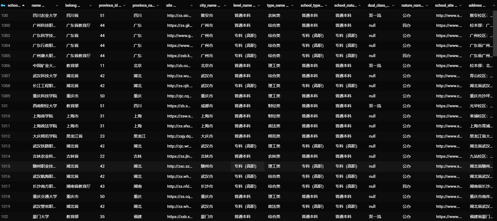

# Hadoop,mapreduce分布式爬取掌上高考的所有中国大学数据

## 欢迎issues，pr
## Windows idea下直接测试hadoop mapreduce方法
### initTest.bat：将hadoop.dll复制到C:\Windows\System32下。【！！！请以管理员运行！！！】
## 思路转变过程
### 1.通过api和js逆向获取首页学校数据，数据较少
### ~~2.通过1信息下的school_id重新构成学校详细的url~~
#### 但利用jsoup访问url后发现数据还是从js加载而来
### ~~3.mapreduce下进行selenium~~
#### 但利用selenium会出现利用port过多和port占用问题
### 4.通过获取到的school_id重构url访问借口访问
### 增加了通过系统判断输入输出路径
#### 目前我的编程环境Windows 10，测试环境Windows 10下虚拟的hadoop暂时还没办法在linux、mac上进行测试，且目前判断linux则为hdfs路径，有兴趣请提交Issues、Pr,
ps 学习用途，请遵循相关法律法规。