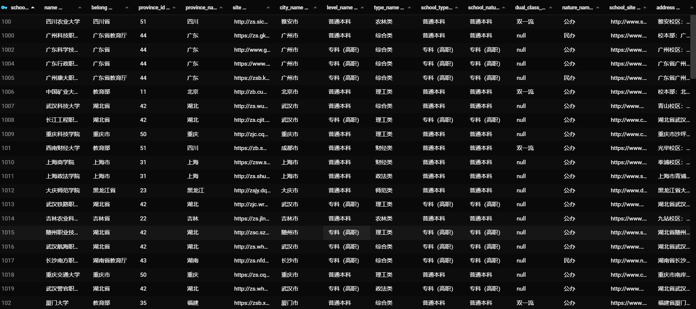

<h1 align="center">ctenopharyngodon-idella</h1>

<p align="center">
<a href="https://www.apache.org/licenses/LICENSE-2.0"></a> 
<a href="https://www.java.com/"></a> 
<a href="https://maven.apache.org/"></a> 
<a href="https://hadoop.apache.org/"></a> 
<a href="https://hadoop.apache.org/docs/r1.2.1/mapred_tutorial.html"></a> 
</p>

## Repository Introduction
Hadoop, MapReduce Distributed Crawling of Data Information from All Chinese Universities  

The widely used MapReduce distributed crawler still recommends using Jsoup, but it cannot parse data loaded by JavaScrip Therefore, this is a warehouse that utilizes Fast Json to crawl data information from all Chinese universities, utilizing the Map Reduce distributed computing crawler in the Hadoop ecosystem At present, my programming environment is Windows10, and virtual Hadoop cannot be tested on Linux or Mac in the testing environment of Windows10. It is currently determined that Linux is an HDFS path. If you are interested, please submit Issues or Pr.



This repository contains：

1. Building a simulated distributed environment under Windows
2. Crawling 掌上高考
3. Data Storage

## Install

This project uses [Java](https://www.java.com/) [Git](https://git-scm.com/), Go check them out if you don't have them locally installed.

```shell
$ git clone https://github.com/weiensong/ScrapySchoolAll.git
```


## Usage
- A truly distributed environment
```shell
$ mvn package

# in Master
$ hadoop jar PackageName.jar
```
- Distributed environment simulated by Windows
	- run initTest.bat directly as administrator 
	- ```command
		> cd /d "%~dp0"
		> copy hadoop.dll C:\Windows\System32
		> cd /src/main/java/job
		> javac MyJob.java
		> java MyJob
		```
		
		

## Related Repository

- [hadoop](https://github.com/apache/hadoop) —Apache Hadoop
- [opsariichthys-bidens](https://github.com/weiensong/opsariichthys-bidens) — Basic information API construction of Chinese national universities.(中国全国大学基本信息API搭建)


## Related Efforts

- [Hadoop](https://hadoop.apache.org/)
- [Maven Central Warehouse](https://mvnrepository.com/)
- [掌上高考](https://www.gaokao.cn/) 


## Maintainers

[@weiensong](https://github.com/weiensong)


## Contributing

Feel free to dive in! [Open an issue](https://github.com/weiensong/ScrapySchoolAll/issues) or submit PRs.

Standard Java follows the [Google apache](https://google.github.io/styleguide/javaguide.html) Code of Conduct.

### Contributors
This project exists thanks to all the people who contribute.


## License

[MIT](https://github.com/weiensong/weiensong/blob/main/.universal/LICENSE) © weiensong

